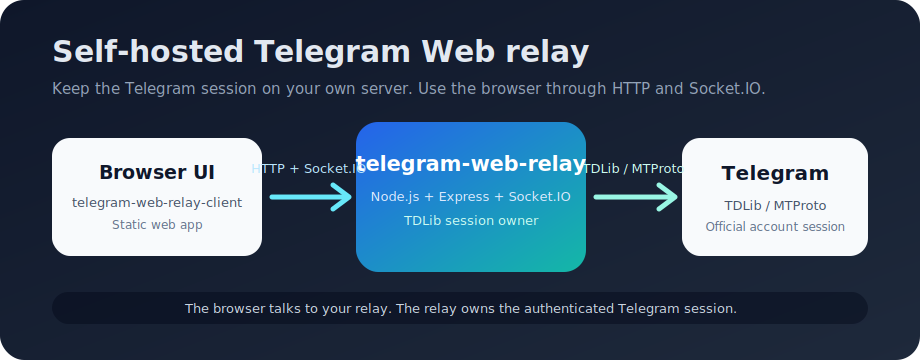

# telegram-web-relay-client

[](https://github.com/lisyoen/telegram-web-relay-client/releases)
[](./LICENSE)
[](https://react.dev/)

English | [한국어](./README.ko.md)

Browser UI for [telegram-web-relay](https://github.com/lisyoen/telegram-web-relay). It is a fork of [Telegram-tt](https://github.com/Ajaxy/telegram-tt) / Telegram Web A adapted to talk to a self-hosted relay over Socket.IO instead of connecting to Telegram directly from the browser.



## How It Fits

```
Browser (this client, GPL-3.0-or-later)
        |
        | HTTP + Socket.IO
        v
telegram-web-relay (server, MIT)  --TDLib/MTProto-->  Telegram
```

The production build creates static assets in `dist/`. The relay server serves that directory with `V2_DIST_PATH`.

## Repository Split

| Repository | Role | License |
| --- | --- | --- |
| [`telegram-web-relay`](https://github.com/lisyoen/telegram-web-relay) | Node.js TDLib relay server and static host | MIT |
| `telegram-web-relay-client` | Browser UI derived from Telegram-tt, adapted for Socket.IO relay transport | GPL-3.0-or-later |

The two projects are separate processes under separate licenses. They communicate over the network only.

## Quickstart

### 1. Build the Client

```sh
git clone https://github.com/lisyoen/telegram-web-relay-client.git
cd telegram-web-relay-client
cp .env.example .env
npm install
npm run build:production
```

Edit `.env` when your relay is not running on `http://localhost:9087`:

```env
TELEGRAM_API_ID=123456
TELEGRAM_API_HASH=your_api_hash
SOCKET_SERVER_URL=http://localhost:9087
BASE_URL=https://web.telegram.org/a/
```

### 2. Serve It from the Relay

```sh
git clone https://github.com/lisyoen/telegram-web-relay.git
cd telegram-web-relay
cp .env.example .env
```

Set the relay's `V2_DIST_PATH` to this project's `dist/` directory:

```env
V2_DIST_PATH=../telegram-web-relay-client/dist
```

Then start the relay:

```sh
npm install
npm start
```

Open the relay URL in a browser and sign in.

## Environment Variables

| Variable | Required | Default | Description |
| --- | --- | --- | --- |
| `TELEGRAM_API_ID` | yes | empty | Telegram API ID from my.telegram.org. Kept for Telegram Web compatibility and build-time checks. |
| `TELEGRAM_API_HASH` | yes | empty | Telegram API hash from my.telegram.org. Kept for Telegram Web compatibility and build-time checks. |
| `SOCKET_SERVER_URL` | no | `http://localhost:9087` | Relay URL used by the browser bundle. |
| `BASE_URL` | no | `https://web.telegram.org/a/` | Upstream Telegram Web base URL compatibility value. |

## Development

```sh
npm install
npm run dev
```

For a mocked UI session:

```sh
npm run dev:mocked
```

For production assets:

```sh
npm run build:production
```

## Security Notes

- This client does not own a Telegram session by itself. The relay server owns the authenticated TDLib session.
- Build-time environment values are embedded into the browser bundle. Do not put unrelated secrets in `.env`.
- Deploy the relay with HTTPS and access control before using it outside a trusted network.

## Issue Bot

New issues receive an automated bilingual triage response and the `needs-triage` label. Maintainers can add `ai-candidate` when an issue is suitable for a future AI coding-agent workflow.

See [docs/issue-bot.md](./docs/issue-bot.md).

## License

This project is licensed under [GPL-3.0-or-later](./LICENSE), inherited from its upstream, Telegram-tt.

The companion relay server, [telegram-web-relay](https://github.com/lisyoen/telegram-web-relay), is a separate MIT project and runs as a separate process.

## Credits

This work is a derivative of [Telegram-tt](https://github.com/Ajaxy/telegram-tt) by Alexander Zinchuk and contributors, which won first prize at the [Telegram Lightweight Client Contest](https://contest.com/javascript-web-3) and is the official Telegram Web A client. Upstream copyright and license notices are retained in `LICENSE` and the source tree.
